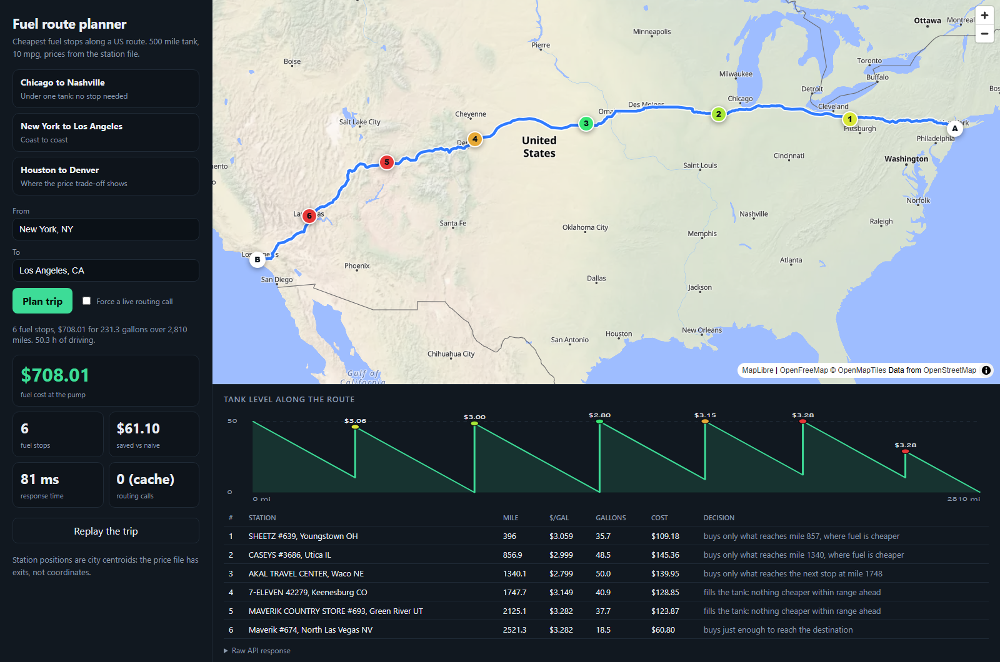
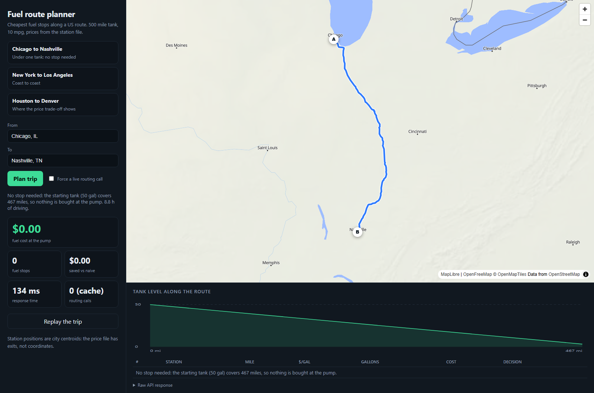
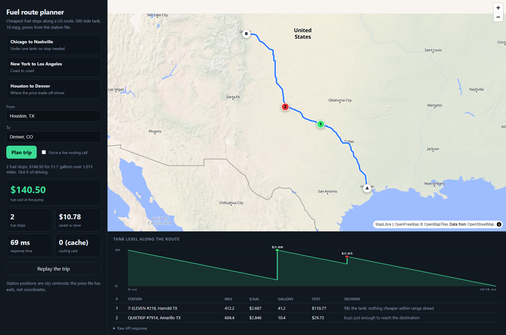

# Fuel route planner

A Django API that takes two places in the contiguous United States and returns the driving route, the cheapest places to buy fuel along it for a 500 mile tank at 10 mpg, and what the fuel costs. One call to a routing service per trip, none when the trip is cached.

```
GET /api/v1/route/?start=New York, NY&finish=Los Angeles, CA
```

New York to Los Angeles, 2,810 miles, from the price file in `data/`:

| # | Station | Mile | $/gal | Gallons | Cost |
|---|---|---|---|---|---|
| 1 | SHEETZ #639, Youngstown OH | 396 | 3.059 | 35.7 | $109.18 |
| 2 | CASEYS #3686, Utica IL | 857 | 2.999 | 48.5 | $145.36 |
| 3 | AKAL TRAVEL CENTER, Waco NE | 1340 | 2.799 | 50.0 | $139.95 |
| 4 | 7-ELEVEN 42279, Keenesburg CO | 1748 | 3.149 | 40.9 | $128.85 |
| 5 | MAVERIK COUNTRY STORE #693, Green River UT | 2125 | 3.282 | 37.7 | $123.87 |
| 6 | Maverik #674, North Las Vegas NV | 2521 | 3.282 | 18.5 | $60.80 |

Total $708.01 for 231.3 gallons, $61.10 less than driving to the farthest reachable station and filling up each time. One routing call.



## Screenshots

Chicago to Nashville is under one tank, so nothing is bought at the pump.



Houston to Denver: fill up at the cheapest station in the file, then buy only what is needed to finish.



## Run it

Windows, one command (installs, loads the data, starts the server, opens the page):

```powershell
.\demo.ps1
```

Anywhere with [uv](https://docs.astral.sh/uv/):

```bash
uv sync
uv run python manage.py migrate
uv run python manage.py import_stations
uv run python manage.py runserver
```

Then open http://127.0.0.1:8000/ for the map, the tank chart and the trip replay, or call the API. `compose.yaml` runs it on gunicorn with PostgreSQL and Redis; CI builds the image, starts it and calls the health endpoint, but does not run the compose stack.

## API

`GET` or `POST /api/v1/route/`

| Parameter | Default | Meaning |
|---|---|---|
| `start`, `finish` | required | `City, ST`, `lat,lon`, or a street address |
| `range_miles`, `mpg` | 500, 10 | vehicle |
| `start_fuel_gallons` | full tank | fuel in the tank at the start |
| `reserve_miles` | 0 | range to keep in the tank on arrival at every stop and at the end |
| `stop_penalty_usd` | 10 | what a stop is worth in driver time when choosing between plans |
| `max_offset_miles` | 10 | how far from the route a station may be |
| `nocache` | false | force a live routing call |

The response has the route as GeoJSON, every stop with its reasoning, totals that add up to the cent from the numbers shown, the naive baseline, and a `meta` block with the number of external calls and the timing of each stage (also sent as a `Server-Timing` header). Errors share one shape, `{"error": {"code", "message"}}`, with a 400 for bad parameters and a 422 for a place that cannot be found, is outside the covered area, or leaves a gap wider than the tank.

`postman/` has a collection that runs six requests with assertions: a trip under one tank, coast to coast, a price trade-off, a cached repeat that must make zero routing calls, a POST with vehicle overrides, and a rejection.

## What the assignment asked, and where it lives

| Asked for | Where |
|---|---|
| Latest stable Django | Django 6.1.1, released September 2, 2026 |
| Start and finish in the USA, map of the route | `routing/locations.py`; GeoJSON in the response and the page at `/` |
| Cheapest fuel stops, 500 mile range, 10 mpg, total cost | `planner/optimizer.py`, `api/service.py` |
| The provided price file | `data/fuel-prices.csv`, loaded by `stations/loader.py` |
| A free map and routing API, one call ideal | OSRM public server, no key. One call, cached; Valhalla is the fallback |
| Fast | see Performance |
| Postman demo | `postman/` |

## Assumptions

- The truck starts with a full tank and may arrive with an empty one. A trip under 500 miles needs no stop and costs nothing at the pump; the response says so.
- The price file has no coordinates, only addresses like `I-44, EXIT 283 & US-69`. Stations sit at the centroid of their city (Census gazetteer, Nominatim for the cities it does not list), so a station can read a few miles off the road. Up to 4 miles counts as on the route; beyond that the round trip, inflated 1.3 times for real roads, is bought as extra fuel. 3,878 of 3,898 cities are located; the other 20 are skipped.
- 597 of 6,738 stations have several prices in the file (median spread $0.09, largest $0.90). The planning price is the median; `FUEL_PRICE_STRATEGY` switches to `min`, `mean` or `max`. 26 identical rows are dropped.
- The file has 620 rows in Canadian provinces. The router does not stay inside the US, so they stay in.
- Each stop is charged $10 of driver time when choosing between plans, and that charge is never part of the fuel bill. Without it the cheapest plan for New York to Los Angeles makes 16 stops, one for 1.1 gallons, to save $6.37. Set `stop_penalty_usd=0` for fuel price only.

## How the optimizer works

Track the frontier: position plus the range left in the tank. Driving leaves it unchanged, buying raises it, and a stop is only possible while the truck can still reach the station and the tank can never hold more than 500 miles. Because every constraint bounds the frontier by a constant, an optimal plan only ever puts it on a finite set of values: the starting range, the station positions and the station positions plus a full tank. The dynamic program in `planner/optimizer.py` runs over exactly that set, so there is no discretization and the answer is exact. It is a handful of numpy operations per station.

Without detours and stop charges this is the fixed-route gas station problem, where "buy just enough to reach a cheaper station, otherwise fill up" is optimal (Khuller, Malekian and Mestre, *To fill or not to fill: the gas station problem*, ACM Transactions on Algorithms, 2011). Detours and stop charges make each stop a fixed-charge decision, which that rule does not solve, hence the program.

## How it is checked

[CI](https://github.com/SpowZy/fuel-route-planner/actions/workflows/ci.yml) runs Ruff, the test suite on SQLite and on PostgreSQL 17, and a container smoke test on every push. Locally, `uv run pytest` runs 93 tests, 94% line coverage. The optimizer is compared with a HiGHS linear program on random instances, with exhaustive search over stop subsets when detours and stop charges are on, and every generated plan is driven to check the tank never goes below empty or above full and that it costs no more than the naive plan. The API tests check that the bill adds up from the numbers shown, that the second request makes zero routing calls, and that a routing failure falls back to Valhalla.

## Performance

`uv run python scripts/bench.py`: 12 routes between US cities, 413 to 2,372 miles, each planned once with a live routing call and then 5 times from the route cache. Windows laptop, in process through Django's test client.

| milliseconds | p50 | p95 | max |
|---|---|---|---|
| cold, server total (live routing call) | 831 | 989 | 1013 |
| warm, server total (route cached) | 24 | 42 | 45 |
| warm, corridor search | 14 | 22 | 23 |
| warm, optimizer | 7 | 17 | 19 |

Every cold request made exactly one external call and every warm request made none. The cold time is the public OSRM server and varies with its load.

## Layout

```
config/     settings, urls
stations/   Station model, price file loader, offline place names, in-memory index
planner/    geometry, corridor search, optimizer, baseline (no Django imports)
routing/    OSRM and Valhalla client, cache, location parsing
api/        endpoint, serializers, error shape
demo/       the page at /
data/       price file, geocoded cities, Census places, saved demo routes
postman/    collection
scripts/    build_geodata.py, bench.py, try_route.py
tests/      unit, property and API tests
```

`uv run python scripts/build_geodata.py --fallback` rebuilds the geocoded cities from the Census gazetteer and Nominatim.

## Configuration

`DATABASE_URL` (PostgreSQL), `REDIS_URL` (route cache), `DJANGO_DEBUG`, `DJANGO_SECRET_KEY`, `DJANGO_ALLOWED_HOSTS`, `FUEL_PRICE_STRATEGY`, `FUEL_INCLUDE_CANADA`, `OSRM_URL`, `VALHALLA_URL`.

## Limits

The public OSRM server has no uptime promise and asks for at most one request per second, which the client respects. City-level station positions limit how exact the detours are. Prices are the ones in the file: nothing is live.
